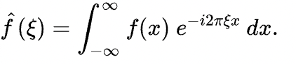
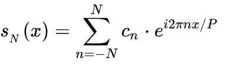
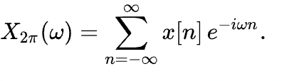
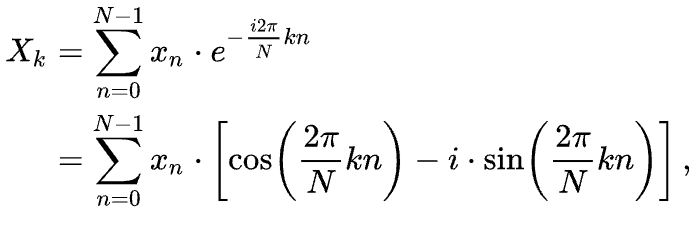
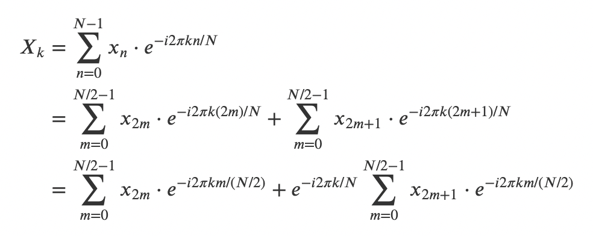

# fft_3sum
Investigation on something I overheard and wanted to discover for myself. I overheard that it was possible to solve the 3SUM computing problem using a FFT.

This has been a really helpful source for FFT: https://pythonnumericalmethods.berkeley.edu/notebooks/chapter24.03-Fast-Fourier-Transform.html

# What is FFT?

Recall the fourier transform:



And the fourier series:



The above has generally been covered in basic university courses.Then we have the "Discrete-Time Fourier Transform", which gives singular points out of a discrete-time input:



 A follow-up to this would be the DFT (discrete fourier transform), which allows us to generate a sequence of values in the frequency domain:



Now, one could simply just compute this in O(n^2) complexity by:

```
import numpy as np
import matplotlib.pyplot as plt

# Generate a 1000-length list of data points with
# Time Parameters
x = []
seconds_per_step = 0.01
seconds = 10
total_steps = int(seconds*(1/seconds_per_step))
for step in range(total_steps):
    value = 0
    value += np.sin((2 * np.pi * 10) * seconds_per_step * step) # f = 10 Hz
    value += np.sin((2 * np.pi * 15) * seconds_per_step * step) # f = 15 Hz
    value += np.sin((2 * np.pi * 25) * seconds_per_step * step) # f = 25 Hz
    x.append(value)

# What we want is X_k = sum(x_n * exp(-j*2*PI*k*n/N))

N = 1000
# Frequency Domain Array
X = []
for k in range(0, N):
	X.append(complex(0, 0))
	for n in range(0, N):
		X[k] += x[n] * np.exp(complex(0, -2 * np.pi * k * n/N))

# Plotting 
fig, ax = plt.subplots(2)
# Time plot
ax[0].plot(x)
# I only really care about magnitude, phase isn't really intuitive for this demo
ax[1].plot([seconds_per_step * step for step in range(total_steps)],[abs(i) for i in X])
plt.show()
```

`NOTE: you can run this in FFT.ipynb`
`NOTE TO SELF: I had trouble understanding the output units, so I added a NOTE to self in the code.`

However, running it this way is inefficient. Thus, the fast fourier transform was born. The key intuition for the most common method (Cooley and Tukey) is shown here:



Essentially, you divide the problem into odds and evens (first step), and then you factor out the e^(...) term. We can see this is symmetrical, so we need to perform the DFT of half the size, but twice.

We can continue this until we reach just a single odd and even number